Lab 02 - Plastic waste
================
Colin Li
1/17/2023

## Load packages and data

``` r
library(tidyverse) 
```

``` r
plastic_waste <- read.csv("data/plastic-waste.csv")
```

## Exercises

\###warm up

``` r
View(plastic_waste)
#Source Editor, Console, Global Environment, and Plots
#240 observations
#NA means missing data
```

### Exercise 1

\#Trinidad and Tobago import tons of plastic every year, so it makes
sense and it’s not data error.

\#It looks like many African countries have less plastic waste per
capita, one or maybe a few North American countries have a lot plastic
waste per capita

``` r
ggplot(data = plastic_waste, aes(x = plastic_waste_per_cap)) +
  geom_histogram(binwidth = 0.2)
```

    ## Warning: Removed 51 rows containing non-finite values (`stat_bin()`).

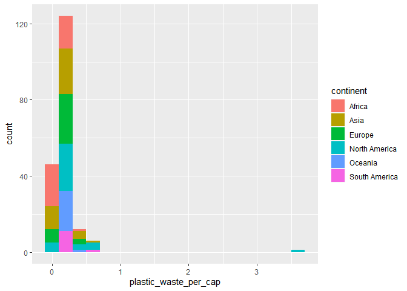<!-- -->

``` r
plastic_waste %>%
  filter(plastic_waste_per_cap > 3.5)
```

    ##   code              entity     continent year gdp_per_cap plastic_waste_per_cap
    ## 1  TTO Trinidad and Tobago North America 2010    31260.91                   3.6
    ##   mismanaged_plastic_waste_per_cap mismanaged_plastic_waste coastal_pop
    ## 1                             0.19                    94066     1358433
    ##   total_pop
    ## 1   1341465

``` r
ggplot(data = plastic_waste, 
       mapping = aes(x = plastic_waste_per_cap, 
                     color = continent)) +
  geom_density()
```

    ## Warning: Removed 51 rows containing non-finite values (`stat_density()`).

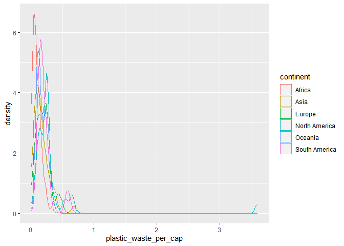<!-- -->

``` r
ggplot(data = plastic_waste, 
       mapping = aes(x = plastic_waste_per_cap, 
                     color = continent, 
                     fill = continent)) +
  geom_density(alpha = 0.7)
```

    ## Warning: Removed 51 rows containing non-finite values (`stat_density()`).

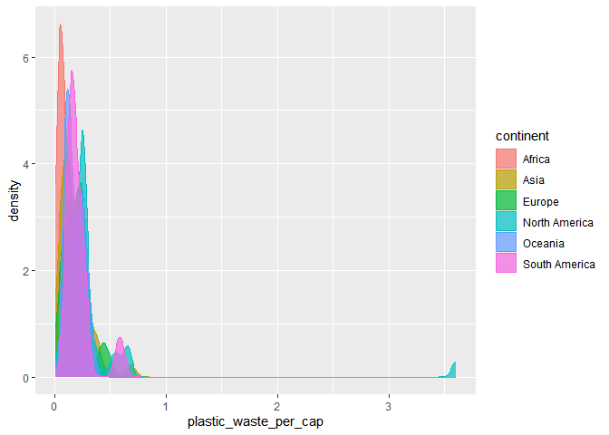<!-- -->

### Exercise 2

\###It looks like color and fill just automatically choose colors for
different continents. Color will color the dots/lines (if there are
any). Fill just fills the colors in the graph. and alpha controls the
density of the graph

``` r
ggplot(data = plastic_waste, 
       mapping = aes(x = plastic_waste_per_cap, 
                     color = continent, fill = continent)) +
  geom_density(alpha = 0.2)
```

    ## Warning: Removed 51 rows containing non-finite values (`stat_density()`).

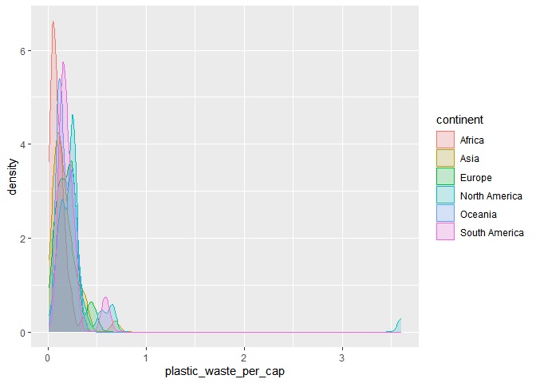<!-- -->

``` r
ggplot(data = plastic_waste, 
       mapping = aes(x = continent, 
                     y = plastic_waste_per_cap)) +
  geom_boxplot()
```

    ## Warning: Removed 51 rows containing non-finite values (`stat_boxplot()`).

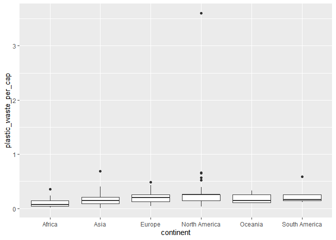<!-- -->

### Exercise 3

What do the violin plots reveal that box plots do not? \#Violin plots
also show density and data distribution (e.g., normality)

What features are apparent in the box plots but not in the violin plots?
\#the medians.

``` r
ggplot(data = plastic_waste, 
       mapping = aes(x = continent, 
                     y = plastic_waste_per_cap)) +
  geom_violin()
```

    ## Warning: Removed 51 rows containing non-finite values (`stat_ydensity()`).

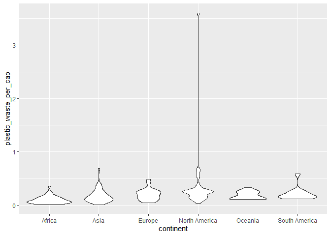<!-- -->

### Exercise 4

``` r
plastic_waste %>%
  summarize(cor(plastic_waste_per_cap, total_pop))
```

    ##   cor(plastic_waste_per_cap, total_pop)
    ## 1                                    NA

### Exercise 5

``` r
ggplot(data = plastic_waste, 
       mapping = aes(x = plastic_waste_per_cap, 
                     y = mismanaged_plastic_waste_per_cap)) +
  geom_point()
```

    ## Warning: Removed 51 rows containing missing values (`geom_point()`).

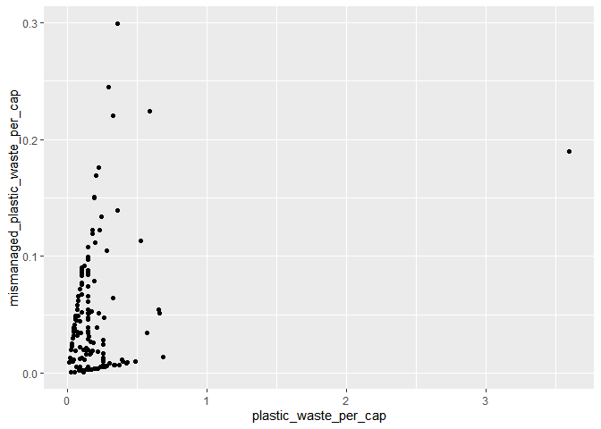<!-- -->

### Exercise 6

\#it looks like a weak positive relationship and it looks like Oceania
has less plastic waste per capita but they mismanage plastic waste more.
Europe did the best in terms of mismanage plastic waste.

``` r
ggplot(data = plastic_waste, 
       mapping = aes(x = plastic_waste_per_cap, 
                     y = mismanaged_plastic_waste_per_cap,
                     color = continent)) +
  geom_point()
```

    ## Warning: Removed 51 rows containing missing values (`geom_point()`).

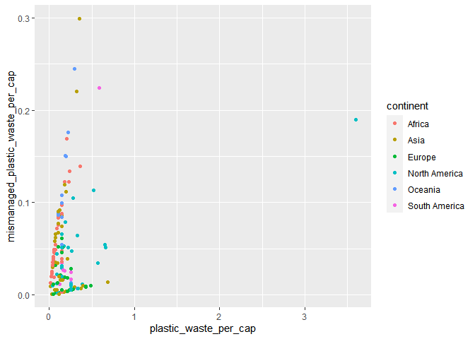<!-- -->

### Exercise 7

\#They don’t seem to be more strongly linearly associated compare to the
previous graph

``` r
ggplot(data = plastic_waste, 
       mapping = aes(x = plastic_waste_per_cap, 
                     y = total_pop,
                     color = continent)) +
  geom_point()
```

    ## Warning: Removed 61 rows containing missing values (`geom_point()`).

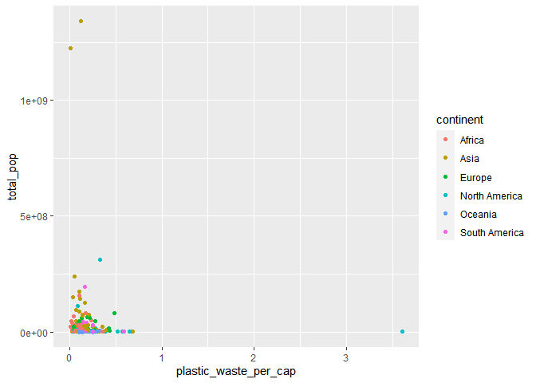<!-- -->

``` r
ggplot(data = plastic_waste, 
       mapping = aes(x = plastic_waste_per_cap, 
                     y = coastal_pop,
                     color = continent)) +
  geom_point()
```

    ## Warning: Removed 51 rows containing missing values (`geom_point()`).

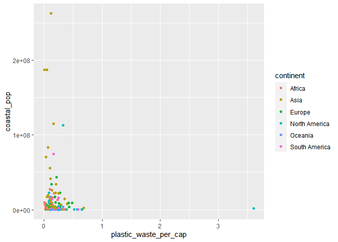<!-- -->

### Exercise 8

\#I think it’s identical except for the color

``` r
library(ggsci)
plastic_waste_f <- plastic_waste %>% 
  filter(plastic_waste_per_cap < 3)

plastic_waste_f$Coastal_pop_pro <- plastic_waste_f$coastal_pop/plastic_waste_f$total_pop

ggplot(data = plastic_waste_f, 
       mapping = aes(x = Coastal_pop_pro, 
                     y = plastic_waste_per_cap)) +
  ggtitle("Plastic waste vs. coastal population proportion", "by continent") + 
  xlab("Coastal population proportion (Coastal / total population)") + 
  ylab("Plastic waste per capita") + 
  geom_point(data = plastic_waste_f, aes(color=continent)) +
  geom_smooth(data = plastic_waste_f, color="black")+ theme(
  panel.background = element_rect(fill = NA),
  panel.grid.major = element_line(colour = "grey"),
) + scale_color_aaas()
```

    ## `geom_smooth()` using method = 'loess' and formula = 'y ~ x'

    ## Warning: Removed 10 rows containing non-finite values (`stat_smooth()`).

    ## Warning: Removed 10 rows containing missing values (`geom_point()`).

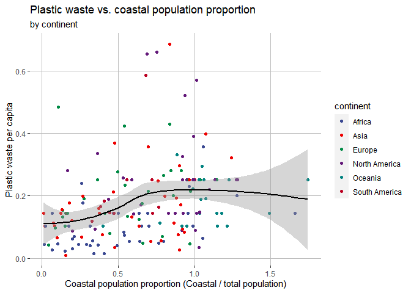<!-- -->
